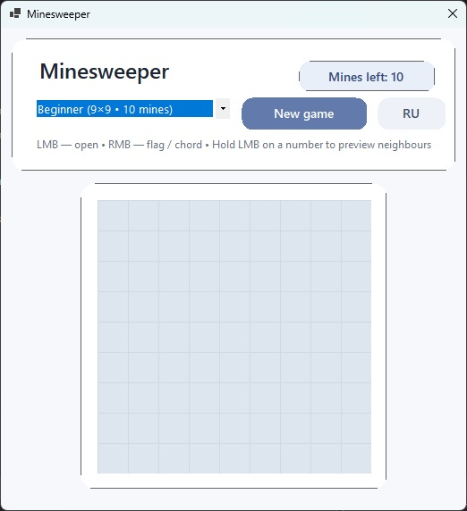

# Minesweeper — WinForms

A desktop implementation of the classic Minesweeper game written in **C#** and **Windows Forms**.

The project separates core game logic from UI state and presentation using an MVVM-inspired structure. It includes multiple difficulty levels, first-click protection, flagging, chord opening, localization, and a custom modernized WinForms interface.

## Features

- Classic Minesweeper gameplay
- Three difficulty levels:
  - Beginner — 9×9, 10 mines
  - Intermediate — 16×16, 40 mines
  - Expert — 16×30, 99 mines
- Safe first click
- Automatic opening of empty areas
- Mine flagging with right mouse button
- Chord opening when the number of adjacent flags matches the cell value
- Neighbour preview while holding the left mouse button on an opened numbered cell
- Remaining mine counter
- English and Russian localization
- Randomized victory and defeat messages
- Dynamic window and board resizing
- Custom WinForms styling and number colors

## Technology Stack

| Technology | Purpose |
|---|---|
| C# | Main programming language |
| .NET 8 | Application platform |
| Windows Forms | Desktop user interface |
| DataGridView | Rendering the game board |
| `INotifyPropertyChanged` | UI state notifications |
| `ICommand` / RelayCommand | Command abstraction |

## Architecture

The project uses a lightweight MVVM-inspired separation of responsibilities.

```text
User
  │
  ▼
WinForms UI
Form1
  │
  ▼
MainViewModel
  │
  ▼
MinesweeperGame
  │
  ▼
Cell / GameSettings
```

### Model

The `Models` directory contains the core game domain:

- `Cell` — represents a single board cell
- `GameSettings` — stores board dimensions and mine count
- `GameDifficulty` — defines available difficulty modes
- `MinesweeperGame` — contains the main game logic

The game model is independent from the visual representation of the board.

### ViewModel

`MainViewModel` connects the game state with the user interface.

It is responsible for:

- starting a new game;
- changing difficulty;
- opening cells;
- toggling flags;
- forwarding game-state changes to the UI;
- handling localized victory and defeat messages.

`ObservableObject` provides property change notifications, while `RelayCommand` provides an `ICommand` implementation.

### View

`Form1` is responsible for WinForms-specific presentation logic:

- rendering the board;
- handling mouse interaction;
- updating cell appearance;
- resizing the window according to the selected board;
- switching between English and Russian;
- displaying game status and result dialogs.

## Game Logic

### Safe first click

Mines are generated only after the player opens the first cell.

The selected cell and its neighbours are excluded from mine placement:

```text
First click
    │
    ▼
Selected cell + adjacent cells marked as safe
    │
    ▼
Mines placed in remaining cells
```

This prevents the game from ending immediately on the first move and usually provides an initial playable area.

### Opening empty areas

When a cell with zero adjacent mines is opened, neighbouring cells are recursively revealed until numbered cells form the boundary of the opened area.

### Flags

Right-clicking a hidden cell toggles a flag.

The remaining mine counter is updated accordingly.

### Chord opening

When an already opened numbered cell has exactly the required number of adjacent flags, right-clicking it opens the remaining neighbouring cells.

This reproduces the standard Minesweeper chord mechanic.

### Neighbour preview

Holding the left mouse button on an opened numbered cell highlights its unopened neighbouring cells.

This gives visual feedback before performing adjacent-cell actions.

## Localization

The application supports:

- English
- Russian

The interface language can be changed while the application is running.

Localized victory and defeat messages are loaded from external resource files:

```text
Recources/
├── En/
│   ├── Congratulations.xam
│   └── Condolences.xam
└── Ru/
    ├── Congratulations.xam
    └── Condolences.xam
```

## Project Structure

```text
MinesweeperGame-WinForms/
├── Saper.sln
└── Saper/
    ├── Models/
    │   ├── Cell.cs
    │   ├── GameDifficulty.cs
    │   ├── GameSettings.cs
    │   └── MinesweeperGame.cs
    │
    ├── ViewModels/
    │   ├── MainViewModel.cs
    │   ├── ObservableObject.cs
    │   └── RelayCommand.cs
    │
    ├── Resources/
    │   ├── En/
    │   └── Ru/
    │
    ├── Form1.cs
    ├── Form1.Designer.cs
    ├── Program.cs
    └── Saper.csproj
```

## Running the Project

### Requirements

- Windows 10/11
- .NET 8 SDK
- Visual Studio 2022, JetBrains Rider, or another .NET-compatible IDE

### Command line

Clone the repository:

```bash
git clone https://github.com/m4ttyV/MinesweeperGame-WinForms.git
cd MinesweeperGame-WinForms
```

Restore and run:

```bash
dotnet restore
dotnet run --project Saper/Saper.csproj
```

### Visual Studio

Open:

```text
Saper.sln
```

Then build and run the project.

## Controls

| Action | Control |
|---|---|
| Open cell | Left mouse button |
| Place/remove flag | Right mouse button |
| Chord opening | Right-click an opened numbered cell |
| Preview neighbours | Hold left mouse button on an opened numbered cell |
| Start new game | `New game` button |
| Change difficulty | Difficulty selector |
| Change language | `RU / EN` button |

## Possible Improvements

- custom board dimensions and mine count;
- game timer;
- best-time statistics;
- persistent settings;
- unit tests for game logic;
- keyboard controls;
- additional themes;
- executable releases through GitHub Actions.

## License

This project is currently provided for demonstration and educational purposes.


